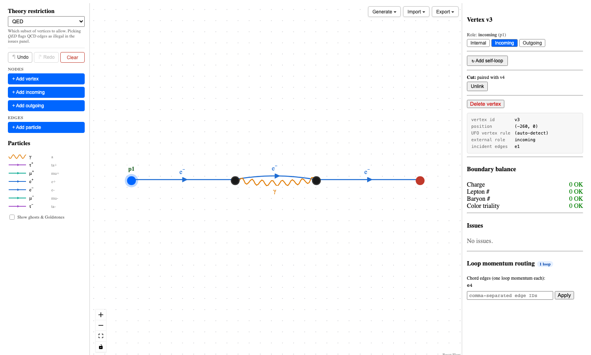

# feynmangraph

[](https://pypi.org/project/feynmangraph/)
[](https://pypi.org/project/feynmangraph/)
[](LICENSE)

Web frontend for building Feynman diagrams. Hand-draw them on a canvas with live conservation/legality checks, or type a process like `e+ e- → mu+ mu-` and have [gammaloop](https://github.com/alphal00p/gammaloop) enumerate the diagrams for you. Forward-scattering cuts, UFO models, and round-trip `.dot` export included.


*1-loop electron self-energy with forward-scattering glue between the incoming and outgoing legs.*

## Install

```bash
pip install feynmangraph
feynmangraph setup     # builds gammaloop
feynmangraph serve     # http://localhost:8000
```

The Canvas, Import, and Export tabs work without `gammaloop`; only the Generate tab needs it. Skip `setup` if you only want the editor.

## What it does

- **Canvas.** Drag vertices, connect propagators, place externals. Charge, lepton number, baryon number, and color triality are checked live, and each vertex is matched against the UFO interaction list — you can't build something that isn't a real diagram.
- **Generate.** Pick a process spec; gammaloop enumerates the diagrams. Speed-up controls: restrict to a particle subset and pick the numerator-isomorphism grouping mode (`no_grouping` for fastest).
- **Forward-scattering cuts.** Pair two externals via `isCut` from a single dropdown. Round-trips through `.dot` including Linnet's `node [isCut="X"]` shorthand.
- **UFO models.** Upload a `.tar.gz` or `.zip` — particles and vertex rules light up immediately.
- **Export.** Single diagram or whole gallery → gammaloop-format `.dot` with projector, half-port IDs, `lmb_id` chords, and `isCut` glue.

Built on [gammaloop](https://github.com/alphal00p/gammaloop) (diagram enumeration + `.dot` dialect), [FastAPI](https://fastapi.tiangolo.com/), [React](https://react.dev/) + [reactflow](https://reactflow.dev/).


## License

MIT
